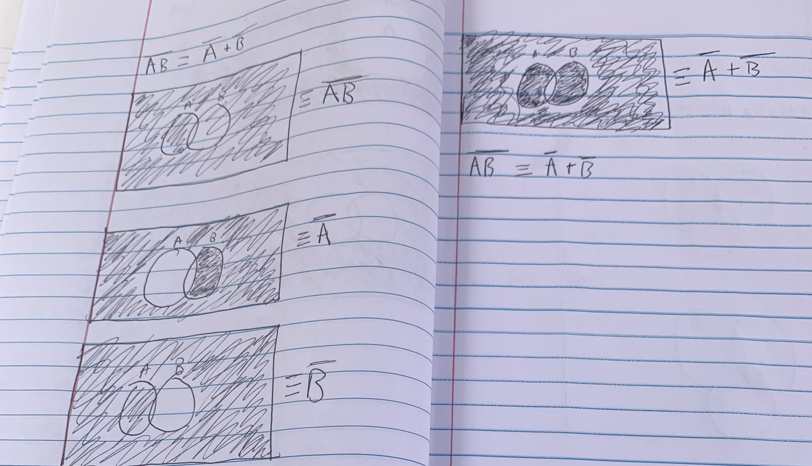

1. The three pillars of science are experiment, theory, and computation data.  
2. Traffic Engineering(data-driven discovery via machine learning) uses cameras to determine between cars: big vehicles, and pedestrians in an environment. Biomedical Data Science(predictive computing) is a technology that catches and prevents medical illnesses like heart attacks and cancer. Adaptative stochastic sampling methods(numerical solution) are used to find experiment and observational data.  
3. The two types of reasoning are deductive and plausible.
4. If it's raining, then the clouds are out. 
5. If a and b, then  c.
6.    
7.  
8.  
